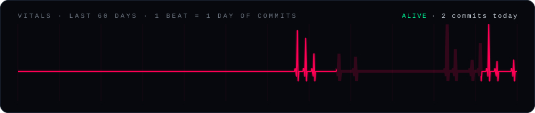
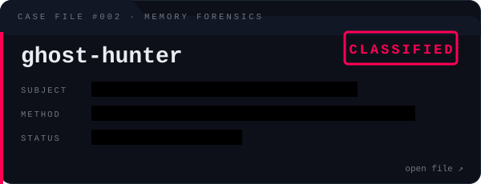
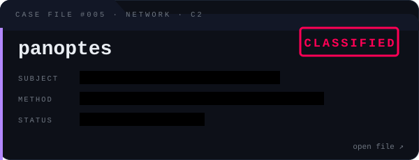
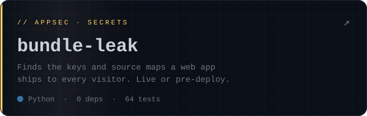
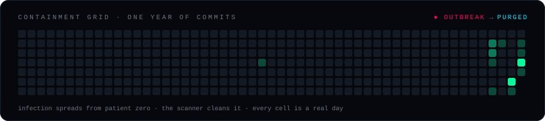

<!--
  reading the source? respect. every visual here is a hand-built animated SVG in /assets —
  no templates, no JS, just SMIL + CSS keyframes.  0x4B495241
-->

  

  
  
  

 

  

  

 

<h3 align="center"><code>[ LIVE DISSECTION ]</code></h3>

  

 

<h3 align="center"><code>[ OBSESSIONS ]</code></h3>

  

<h3 align="center"><code>[ CASE FILES ]</code></h3>

  
  
  
  
  
  

<code>▸ classified files (8 more)</code>

 

  
  
  
  
  
  
  
  

<h3 align="center"><code>[ BODY COUNT ]</code></h3>

  
   
  

<h3 align="center"><code>[ ARSENAL ]</code></h3>

  
   
  
   
  

  
  
  
  
  
  
  
   
  
  
  
  
  
  
   
  
  
  
  
  
  
   
  
  
  
  
  
  

  

